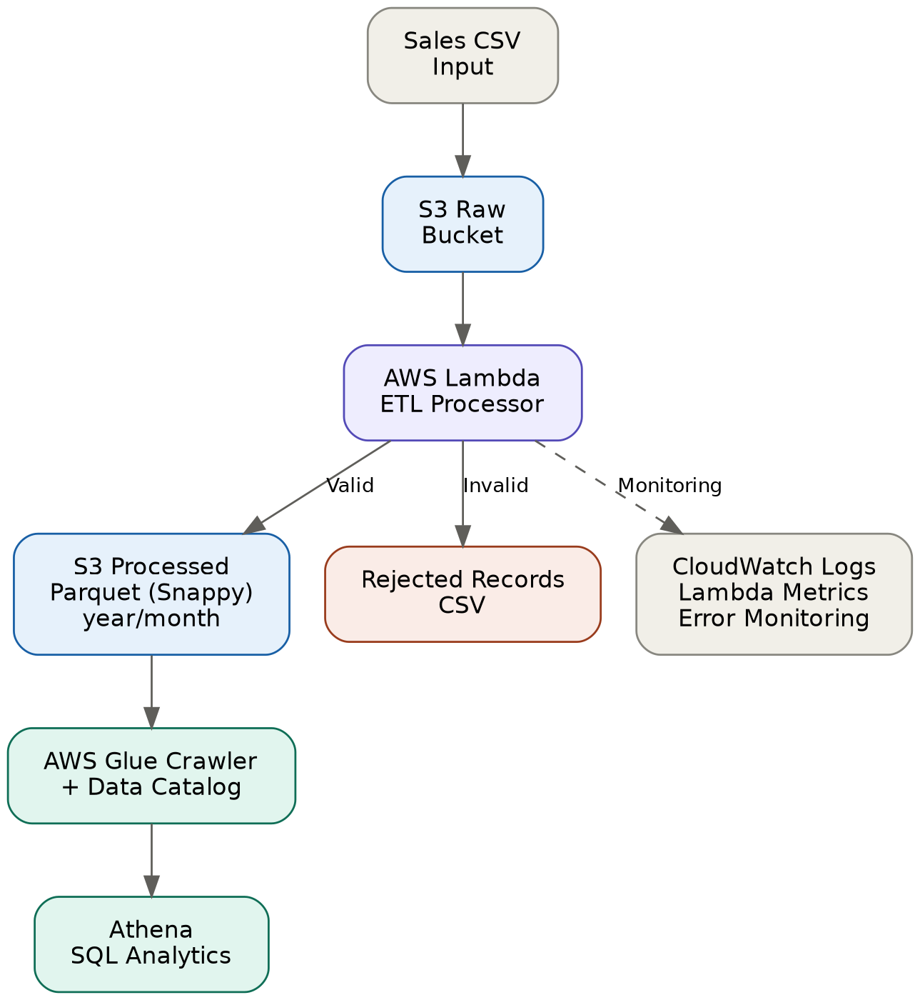

# Sales Data ETL Pipeline on AWS

An end-to-end cloud-based data engineering project that ingests sales data from Amazon S3, processes and validates it using AWS Lambda, converts valid records to optimized Parquet format, catalogs the data using AWS Glue, and enables SQL analytics through Amazon Athena.

## Architecture



### Pipeline Flow

```text
Sales CSV
    │
    ▼
Amazon S3
Raw Bucket
    │
    ▼
AWS Lambda
ETL Processing
    │
    ├───────────────┐
    │               │
    ▼               ▼
Valid Records    Invalid Records
    │               │
    ▼               ▼
Parquet          Rejected CSV
Snappy
Compression
    │
    ▼
Year/Month
Partitioning
    │
    ▼
Amazon S3
Processed Bucket
    │
    ▼
AWS Glue
Crawler + Data Catalog
    │
    ▼
Amazon Athena
SQL Analytics

CloudWatch Logs + Lambda Metrics
              │
              ▼
         Monitoring
```

## Project Overview

The purpose of this project is to build a practical sales-data ETL pipeline using AWS services.

The pipeline automatically processes sales CSV files uploaded to Amazon S3. AWS Lambda validates and transforms the incoming data, separates valid and invalid records, converts valid data to Parquet, applies Snappy compression, and partitions the output by year and month.

AWS Glue catalogs the processed data, allowing Amazon Athena to query the dataset using SQL.

The pipeline also includes data-quality validation and monitoring using Amazon CloudWatch.

## Objectives

- Build an automated sales-data ETL pipeline on AWS.
- Ingest raw CSV files through Amazon S3.
- Process sales data using AWS Lambda.
- Validate incoming records.
- Detect duplicate records.
- Detect missing values.
- Validate prices.
- Validate quantities.
- Validate dates.
- Separate valid and invalid records.
- Convert processed data to Parquet.
- Apply Snappy compression.
- Partition data by year and month.
- Catalog the data using AWS Glue.
- Query the processed data using Amazon Athena.
- Monitor the pipeline using CloudWatch Logs and Lambda metrics.

## AWS Services Used

| AWS Service | Purpose |
|---|---|
| Amazon S3 | Raw and processed data storage |
| AWS Lambda | ETL processing and validation |
| AWS Glue | Data cataloging and schema discovery |
| Amazon Athena | SQL-based data analysis |
| Amazon CloudWatch | Logging and monitoring |

## Data Flow

### 1. Data Ingestion

Sales CSV files are uploaded to the Raw S3 bucket.

```text
S3 Raw Bucket
└── raw/
    └── sales.csv
```

### 2. ETL Processing

The S3 upload triggers the `Sales-ETL-Processor` Lambda function.

Lambda performs:

- Schema validation
- Required-field validation
- Duplicate detection
- Price validation
- Quantity validation
- Date validation
- Data transformation

### 3. Valid and Invalid Records

Valid records continue through the pipeline.

Invalid records are separated and stored as rejected records.

```text
Input Records
      │
      ▼
   Validation
      │
 ┌────┴────┐
 ▼         ▼
Valid    Invalid
 │         │
 ▼         ▼
Parquet  Rejected
         CSV
```

### 4. Parquet Conversion

Valid records are converted to Parquet format.

Snappy compression is applied to the Parquet data.

### 5. Partitioning

The processed data is partitioned by year and month.

Example:

```text
processed/
└── parquet/
    └── year=2026/
        └── month=08/
            └── sales_processed.parquet
```

### 6. Data Catalog

AWS Glue crawls the processed Parquet data and creates metadata in the Glue Data Catalog.

### 7. Analytics

Amazon Athena is used to query the processed dataset using SQL.

## Data Quality

The pipeline was intentionally tested with several types of invalid data.

### Duplicate Records

Duplicate `OrderID` values were introduced to verify duplicate detection.

### Missing Values

Missing values were introduced into required fields including:

- Product
- Quantity
- UnitPrice
- OrderDate
- Country

### Invalid Prices

The pipeline was tested with:

- Negative prices
- Non-numeric prices

### Invalid Quantities

The pipeline was tested with:

- Zero quantities
- Negative quantities
- Non-numeric quantities

### Bad Dates

The pipeline was tested with:

- Incorrect date formats
- Invalid months
- Invalid calendar dates

## Data Lake Optimization

The project demonstrates several data-lake optimization concepts.

### CSV vs Parquet

CSV is useful for simple data exchange and ingestion, while Parquet is better suited for analytical workloads because it uses a columnar storage format.

### Compression

Snappy compression is applied to the Parquet output to reduce the amount of storage and data that needs to be read.

### Partitioning

The processed data is partitioned by year and month.

This allows Athena to use partition pruning when queries include partition filters.

### Athena Query Costs

Athena charges according to the amount of data scanned by queries.

Using Parquet, compression, and partitioning can reduce unnecessary data scanning, particularly as datasets become larger.

## Monitoring

The pipeline uses Amazon CloudWatch and Lambda monitoring.

### CloudWatch Logs

CloudWatch Logs provide detailed information about individual ETL executions.

The pipeline records events such as:

```text
etl_started
record_rejected
etl_summary
etl_completed
etl_failed
```

### Lambda Metrics

Lambda monitoring provides metrics such as:

- Invocations
- Errors
- Duration
- Throttles

### Error Monitoring

An intentional error test was performed to verify that ETL failures can be detected through CloudWatch Logs and Lambda metrics.

## Athena Queries

Example query:

```sql
SELECT *
FROM your_table_name
LIMIT 10;
```

Partition-filtered query:

```sql
SELECT
    Product,
    Quantity,
    UnitPrice,
    TotalPrice
FROM your_table_name
WHERE year = 2026
  AND month = 8;
```

The complete SQL examples are available in the `sql/` directory.

## Repository Structure

```text
sales-data-etl-pipeline-aws/
│
├── README.md
│
├── lambda/
│   └── lambda_function.py
│
├── sql/
│   ├── basic_sales_query.sql
│   └── partition_query.sql
│
├── data/
│   ├── raw/
│   │   └── sales_sample.csv
│   │
│   └── sample/
│       ├── duplicate_test.csv
│       ├── missing_values_test.csv
│       ├── invalid_prices_test.csv
│       ├── invalid_quantities_test.csv
│       └── bad_dates_test.csv
│
├── screenshots/
│   ├── 01-s3-buckets.png
│   ├── 02-lambda-function.png
│   ├── 03-lambda-success.png
│   ├── 04-parquet-output.png
│   ├── 05-glue-crawler.png
│   ├── 06-athena-query.png
│   ├── 07-cloudwatch-logs.png
│   └── 08-lambda-metrics.png
│
├── architecture/
│   └── aws-sales-etl-architecture.png
│
└── docs/
    └── project-documentation.md
```

## Testing

The pipeline was tested through:

- Successful ETL execution
- S3-triggered processing
- Duplicate-record testing
- Missing-value testing
- Invalid-price testing
- Invalid-quantity testing
- Bad-date testing
- Error-handling testing
- CloudWatch log verification
- Lambda metric verification

## Key Data Engineering Concepts Demonstrated

- ETL pipelines
- Cloud-based data ingestion
- Data validation
- Data-quality handling
- Duplicate detection
- Error handling
- Columnar storage
- Parquet
- Snappy compression
- Data partitioning
- AWS Glue Data Catalog
- SQL analytics with Athena
- Cloud monitoring
- Serverless data processing

## Project Outcome

The completed project provides an automated workflow for transforming raw sales CSV data into validated, compressed, partitioned Parquet data that can be queried using SQL.

It demonstrates practical experience with AWS-based data engineering, including data ingestion, transformation, validation, optimization, cataloging, analytics, and monitoring.